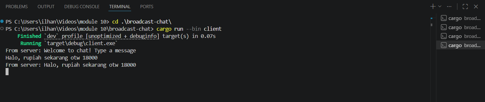
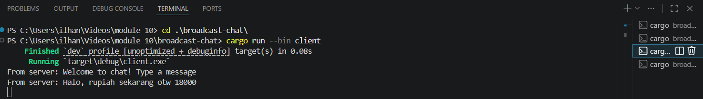
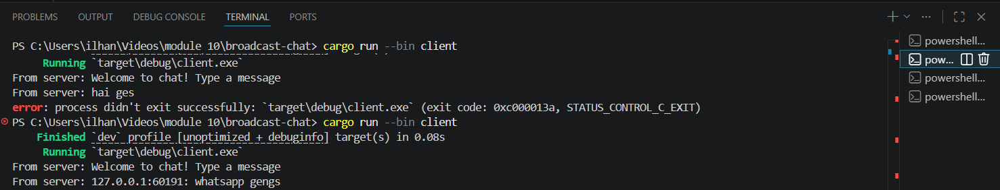
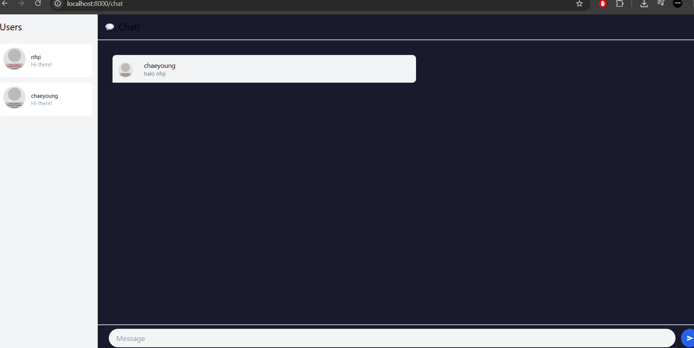
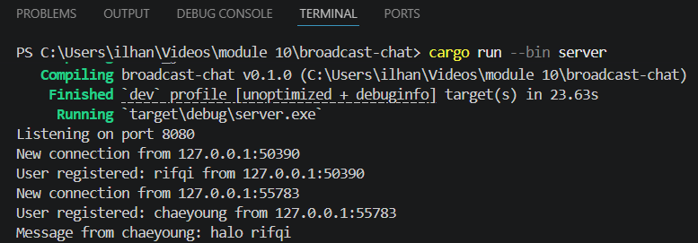

# Broadcast

 Jalankan server terlebih dahulu dengan cargo run --bin server, kemudian buka terminal baru dan jalankan cargo run --bin client sebanyak 3 kali. Setiap pesan yang diketik di satu client akan di-broadcast ke semua client yang terhubung melalui server. Server menggunakan tokio::broadcast channel untuk mendistribusikan pesan ke semua subscriber. Seperti pada contoh, kita mengirim pesan di terminal paling bawah (lihat sebelah kanan), tapi message juga masuk di terminal ke-3.

 # changing the port
 Ada 2 file yang perlu dimodifikasi: server.rs (bagian TcpListener::bind) dan client.rs (bagian ClientBuilder::from_uri). Keduanya menggunakan protokol WebSocket (ws://), yang didefinisikan langsung di URI pada client dan implisit melalui ServerBuilder pada server. Protokol WebSocket berjalan di atas TCP, sehingga port diganti di kedua sisi koneksi.

 # add port information to client
 
 Modifikasi dilakukan di server.rs pada fungsi handle_connection. Sebelum pesan di-broadcast, kita format ulang dengan menambahkan addr (IP dan Port dari pengirim) menggunakan format!("{addr}: {text}"). Dengan begitu, setiap client yang menerima pesan dapat mengetahui dari mana pesan tersebut berasal, bukan hanya isi pesannya saja. Sepeti pada contoh gambar, client di terminal ke-2 bisa melihat ip dan port milik terminal ke-3 (yang mengirim pesan)

 # bonus

Pada bagian bonus ini, saya mengganti WebSocket server JavaScript (SimpleWebsocketServer) dengan server Rust dari Tutorial 2 (broadcast-chat) yang dimodifikasi.

Perubahan yang dilakukan adalah Server Rust dimodifikasi untuk memahami format JSON yang digunakan YewChat, saat user login, client mengirim {"messageType":"register","data":"username"}. Server menyimpan username dan broadcast daftar user terbaru ke semua client. Untuk message, aat user mengirim pesan, client mengirim {"messageType":"message","data":"isi pesan"}. Server membungkus pesan dengan info pengirim lalu broadcast ke semua client. Dan setiap kali ada user connect/disconnect, server broadcast {"messageType":"users","dataArray":["user1","user2"]} agar sidebar user selalu update.

Hal ini berhasil karena YewChat mengirim dan menerima pesan sebagai JSON string melalui WebSocket. Server Rust cukup mem-parse JSON tersebut menggunakan serde_json, memproses sesuai messageType, lalu broadcast kembali dalam format JSON yang sama. Tidak ada perubahan di sisi client (YewChat).

Kalau preferensi, Saya lebih memilih server Rust dibanding JavaScript karena lebih efisien dalam penggunaan memori, type-safe berkat sistem tipe Rust, dan lebih konsisten dengan ekosistem proyek yang sudah menggunakan Rust. Selain itu, error terdeteksi saat compile time bukan runtime.
